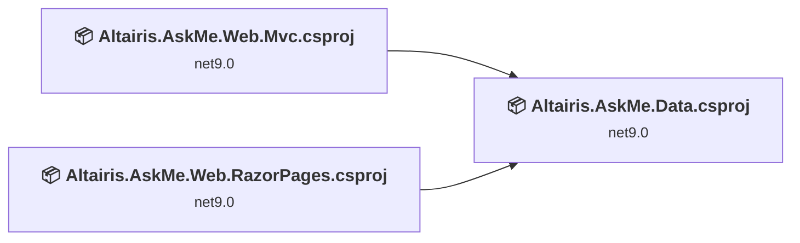
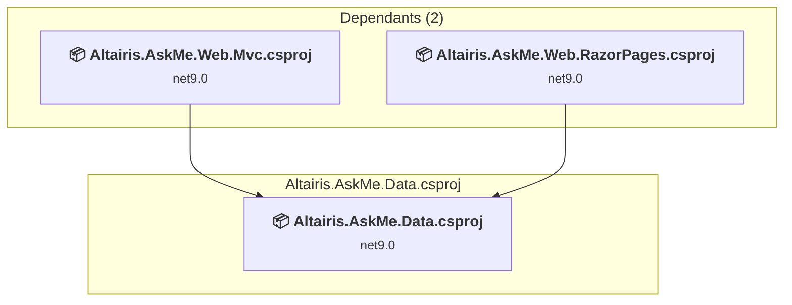
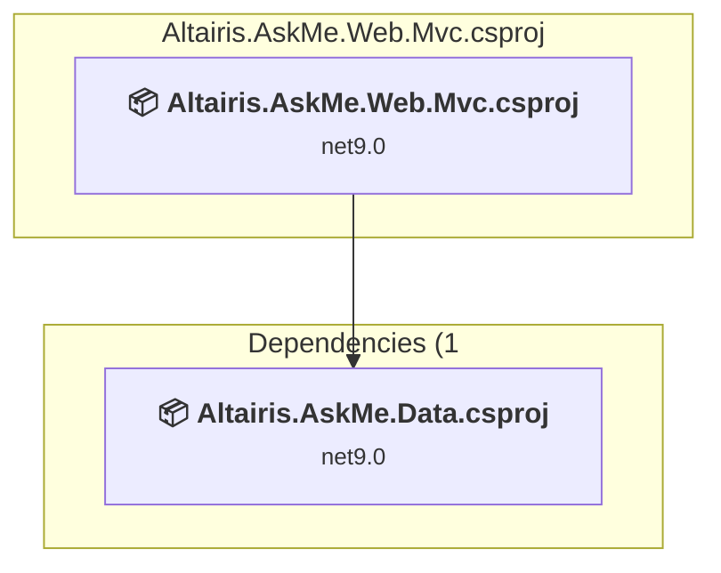
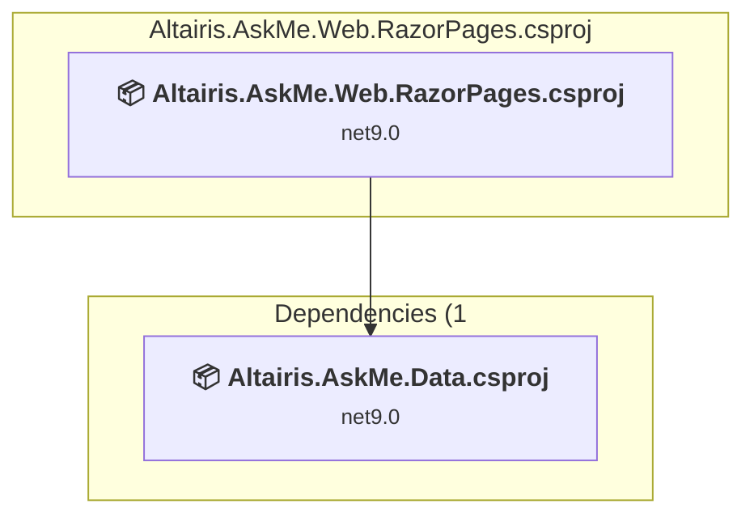

# Projects and dependencies analysis

This document provides a comprehensive overview of the projects and their dependencies in the context of upgrading to .NETCoreApp,Version=v10.0.

## Table of Contents

- [Executive Summary](#executive-Summary)
  - [Highlevel Metrics](#highlevel-metrics)
  - [Projects Compatibility](#projects-compatibility)
  - [Package Compatibility](#package-compatibility)
  - [API Compatibility](#api-compatibility)
- [Aggregate NuGet packages details](#aggregate-nuget-packages-details)
- [Top API Migration Challenges](#top-api-migration-challenges)
  - [Technologies and Features](#technologies-and-features)
  - [Most Frequent API Issues](#most-frequent-api-issues)
- [Projects Relationship Graph](#projects-relationship-graph)
- [Project Details](#project-details)

  - [Altairis.AskMe.Data\Altairis.AskMe.Data.csproj](#altairisaskmedataaltairisaskmedatacsproj)
  - [Altairis.AskMe.Web.Mvc\Altairis.AskMe.Web.Mvc.csproj](#altairisaskmewebmvcaltairisaskmewebmvccsproj)
  - [Altairis.AskMe.Web.RazorPages\Altairis.AskMe.Web.RazorPages.csproj](#altairisaskmewebrazorpagesaltairisaskmewebrazorpagescsproj)

## Executive Summary

### Highlevel Metrics

| Metric | Count | Status |
| :--- | :---: | :--- |
| Total Projects | 3 | All require upgrade |
| Total NuGet Packages | 9 | 6 need upgrade |
| Total Code Files | 93 |  |
| Total Code Files with Incidents | 9 |  |
| Total Lines of Code | 4099 |  |
| Total Number of Issues | 29 |  |
| Estimated LOC to modify | 14+ | at least 0.3% of codebase |

### Projects Compatibility

| Project | Target Framework | Difficulty | Package Issues | API Issues | Est. LOC Impact | Description |
| :--- | :---: | :---: | :---: | :---: | :---: | :--- |
| [Altairis.AskMe.Data\Altairis.AskMe.Data.csproj](#altairisaskmedataaltairisaskmedatacsproj) | net9.0 | 🟢 Low | 4 | 0 |  | ClassLibrary, Sdk Style = True |
| [Altairis.AskMe.Web.Mvc\Altairis.AskMe.Web.Mvc.csproj](#altairisaskmewebmvcaltairisaskmewebmvccsproj) | net9.0 | 🟢 Low | 4 | 7 | 7+ | AspNetCore, Sdk Style = True |
| [Altairis.AskMe.Web.RazorPages\Altairis.AskMe.Web.RazorPages.csproj](#altairisaskmewebrazorpagesaltairisaskmewebrazorpagescsproj) | net9.0 | 🟢 Low | 4 | 7 | 7+ | AspNetCore, Sdk Style = True |

### Package Compatibility

| Status | Count | Percentage |
| :--- | :---: | :---: |
| ✅ Compatible | 3 | 33.3% |
| ⚠️ Incompatible | 0 | 0.0% |
| 🔄 Upgrade Recommended | 6 | 66.7% |
| ***Total NuGet Packages*** | ***9*** | ***100%*** |

### API Compatibility

| Category | Count | Impact |
| :--- | :---: | :--- |
| 🔴 Binary Incompatible | 2 | High - Require code changes |
| 🟡 Source Incompatible | 8 | Medium - Needs re-compilation and potential conflicting API error fixing |
| 🔵 Behavioral change | 4 | Low - Behavioral changes that may require testing at runtime |
| ✅ Compatible | 15946 |  |
| ***Total APIs Analyzed*** | ***15960*** |  |

## Aggregate NuGet packages details

| Package | Current Version | Suggested Version | Projects | Description |
| :--- | :---: | :---: | :--- | :--- |
| Microsoft.AspNetCore.Diagnostics.EntityFrameworkCore | 9.0.5 | 10.0.5 | [Altairis.AskMe.Web.Mvc.csproj](#altairisaskmewebmvcaltairisaskmewebmvccsproj) [Altairis.AskMe.Web.RazorPages.csproj](#altairisaskmewebrazorpagesaltairisaskmewebrazorpagescsproj) | NuGet package upgrade is recommended |
| Microsoft.AspNetCore.Identity.EntityFrameworkCore | 9.0.5 | 10.0.5 | [Altairis.AskMe.Data.csproj](#altairisaskmedataaltairisaskmedatacsproj) | NuGet package upgrade is recommended |
| Microsoft.EntityFrameworkCore.Design | 9.0.5 | 10.0.5 | [Altairis.AskMe.Web.Mvc.csproj](#altairisaskmewebmvcaltairisaskmewebmvccsproj) [Altairis.AskMe.Web.RazorPages.csproj](#altairisaskmewebrazorpagesaltairisaskmewebrazorpagescsproj) | NuGet package upgrade is recommended |
| Microsoft.EntityFrameworkCore.Sqlite | 9.0.5 | 10.0.5 | [Altairis.AskMe.Data.csproj](#altairisaskmedataaltairisaskmedatacsproj) | NuGet package upgrade is recommended |
| Microsoft.EntityFrameworkCore.SqlServer | 9.0.5 | 10.0.5 | [Altairis.AskMe.Data.csproj](#altairisaskmedataaltairisaskmedatacsproj) | NuGet package upgrade is recommended |
| Microsoft.EntityFrameworkCore.Tools | 9.0.5 | 10.0.5 | [Altairis.AskMe.Data.csproj](#altairisaskmedataaltairisaskmedatacsproj) | NuGet package upgrade is recommended |
| Microsoft.SyndicationFeed.ReaderWriter | 1.0.2 |  | [Altairis.AskMe.Web.Mvc.csproj](#altairisaskmewebmvcaltairisaskmewebmvccsproj) [Altairis.AskMe.Web.RazorPages.csproj](#altairisaskmewebrazorpagesaltairisaskmewebrazorpagescsproj) | ✅Compatible |
| Microsoft.VisualStudio.Web.BrowserLink | 2.2.0 |  | [Altairis.AskMe.Web.Mvc.csproj](#altairisaskmewebmvcaltairisaskmewebmvccsproj) [Altairis.AskMe.Web.RazorPages.csproj](#altairisaskmewebrazorpagesaltairisaskmewebrazorpagescsproj) | NuGet package functionality is included with framework reference |
| NLipsum | 1.1.0 |  | [Altairis.AskMe.Data.csproj](#altairisaskmedataaltairisaskmedatacsproj) | ✅Compatible |

## Top API Migration Challenges

### Technologies and Features

| Technology | Issues | Percentage | Migration Path |
| :--- | :---: | :---: | :--- |

### Most Frequent API Issues

| API | Count | Percentage | Category |
| :--- | :---: | :---: | :--- |
| T:System.Uri | 2 | 14.3% | Behavioral Change |
| M:System.Uri.#ctor(System.String) | 2 | 14.3% | Behavioral Change |
| M:System.String.Split(System.ReadOnlySpan{System.Char}) | 2 | 14.3% | Source Incompatible |
| M:Microsoft.Extensions.DependencyInjection.OptionsConfigurationServiceCollectionExtensions.Configure''1(Microsoft.Extensions.DependencyInjection.IServiceCollection,Microsoft.Extensions.Configuration.IConfiguration) | 2 | 14.3% | Binary Incompatible |
| M:System.TimeSpan.FromDays(System.Int32) | 2 | 14.3% | Source Incompatible |
| T:Microsoft.Extensions.DependencyInjection.IdentityEntityFrameworkBuilderExtensions | 2 | 14.3% | Source Incompatible |
| M:Microsoft.Extensions.DependencyInjection.IdentityEntityFrameworkBuilderExtensions.AddEntityFrameworkStores''1(Microsoft.AspNetCore.Identity.IdentityBuilder) | 2 | 14.3% | Source Incompatible |

## Projects Relationship Graph

Legend:
📦 SDK-style project
⚙️ Classic project

## Project Details

### Altairis.AskMe.Data\Altairis.AskMe.Data.csproj

#### Project Info

- **Current Target Framework:** net9.0
- **Proposed Target Framework:** net10.0
- **SDK-style**: True
- **Project Kind:** ClassLibrary
- **Dependencies**: 0
- **Dependants**: 2
- **Number of Files**: 13
- **Number of Files with Incidents**: 1
- **Lines of Code**: 2015
- **Estimated LOC to modify**: 0+ (at least 0.0% of the project)

#### Dependency Graph

Legend:
📦 SDK-style project
⚙️ Classic project

### API Compatibility

| Category | Count | Impact |
| :--- | :---: | :--- |
| 🔴 Binary Incompatible | 0 | High - Require code changes |
| 🟡 Source Incompatible | 0 | Medium - Needs re-compilation and potential conflicting API error fixing |
| 🔵 Behavioral change | 0 | Low - Behavioral changes that may require testing at runtime |
| ✅ Compatible | 2817 |  |
| ***Total APIs Analyzed*** | ***2817*** |  |

### Altairis.AskMe.Web.Mvc\Altairis.AskMe.Web.Mvc.csproj

#### Project Info

- **Current Target Framework:** net9.0
- **Proposed Target Framework:** net10.0
- **SDK-style**: True
- **Project Kind:** AspNetCore
- **Dependencies**: 1
- **Dependants**: 0
- **Number of Files**: 51
- **Number of Files with Incidents**: 4
- **Lines of Code**: 1043
- **Estimated LOC to modify**: 7+ (at least 0.7% of the project)

#### Dependency Graph

Legend:
📦 SDK-style project
⚙️ Classic project

### API Compatibility

| Category | Count | Impact |
| :--- | :---: | :--- |
| 🔴 Binary Incompatible | 1 | High - Require code changes |
| 🟡 Source Incompatible | 4 | Medium - Needs re-compilation and potential conflicting API error fixing |
| 🔵 Behavioral change | 2 | Low - Behavioral changes that may require testing at runtime |
| ✅ Compatible | 6667 |  |
| ***Total APIs Analyzed*** | ***6674*** |  |

### Altairis.AskMe.Web.RazorPages\Altairis.AskMe.Web.RazorPages.csproj

#### Project Info

- **Current Target Framework:** net9.0
- **Proposed Target Framework:** net10.0
- **SDK-style**: True
- **Project Kind:** AspNetCore
- **Dependencies**: 1
- **Dependants**: 0
- **Number of Files**: 51
- **Number of Files with Incidents**: 4
- **Lines of Code**: 1041
- **Estimated LOC to modify**: 7+ (at least 0.7% of the project)

#### Dependency Graph

Legend:
📦 SDK-style project
⚙️ Classic project

### API Compatibility

| Category | Count | Impact |
| :--- | :---: | :--- |
| 🔴 Binary Incompatible | 1 | High - Require code changes |
| 🟡 Source Incompatible | 4 | Medium - Needs re-compilation and potential conflicting API error fixing |
| 🔵 Behavioral change | 2 | Low - Behavioral changes that may require testing at runtime |
| ✅ Compatible | 6462 |  |
| ***Total APIs Analyzed*** | ***6469*** |  |

